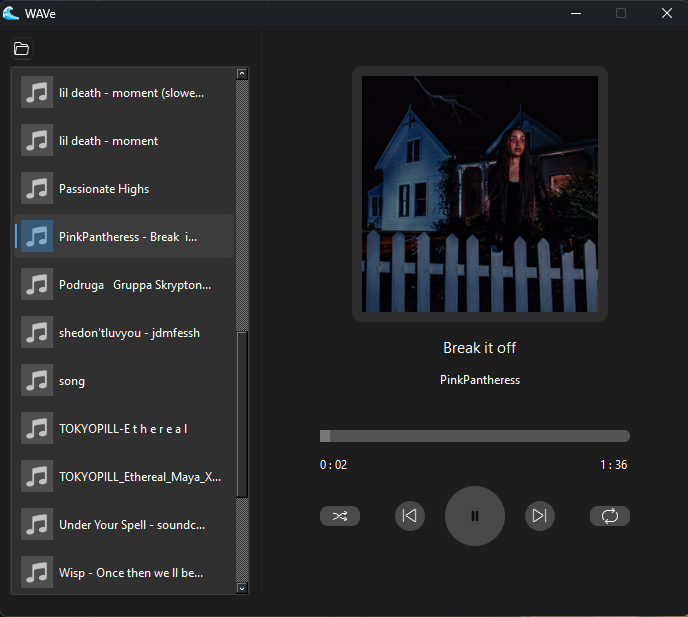

# **audio-wave**

Simple C++ audio player to play music

---

## **Key Features**
- You can use it as desktop player to play music
- Supports .wav and .mp3
- Repeat and Shuffle modes

---

## **Usage**

**!This project uses QT, so you need it to build and run the project**

### Setup:
- Download this project via git `git clone https://github.com/VadiksMoniks/audio-wave` or just by copying files.
- Then go to https://github.com/lieff/minimp3 and download `minimp3_ex.h` and `minimp3.h`
- You also need to download **SDL2** library
- After instaling SDL2 change `CMake.txt` on line 15. Enter your path to this lib
- Add some songs into `music` folder
- After all you can build the project and test it by your own

## **How it looks like**
